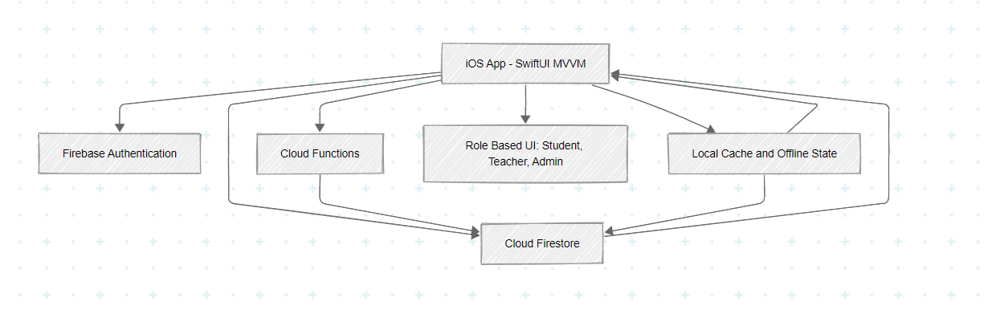

# ClassWiz Project Report

## Objective

The objective of ClassWiz is to build a role-based academic management system that simplifies routine and attendance operations while providing meaningful attendance insights for students, teachers, and administrators.

## Introduction

ClassWiz is an iOS application developed with SwiftUI and Firebase to manage class schedules, attendance records, and attendance analytics. The project focuses on practical classroom workflows and decision support, not only data storage. It is designed for daily use in real academic environments where reliability, clarity, and role-based access are essential.

## Methodology

The project follows an iterative, module-based development approach:

1. Requirements and workflow analysis for student, teacher, and admin roles.
2. SwiftUI interface design with MVVM architecture.
3. Firebase integration for authentication and cloud data management.
4. Service-layer implementation for routine, attendance, user, and assignment operations.
5. Testing and validation of role-specific flows and UI states.
6. Documentation and synchronization process for team-based development.

## Unique Features

- Role-based workflow separation (Student, Teacher, Admin).
- Attendance risk tracking and analytics-focused feedback.
- Student what-if simulation and leaderboard features.
- Offline-aware components (status banners and sync indicators).
- Admin tools for course, batch, routine, and teacher assignment management.
- Team-oriented documentation and controlled multi-branch push workflow.

## Lab Topics Covered

- SwiftUI views, navigation, and state management.
- MVVM architecture and ViewModel-driven UI updates.
- Firebase Authentication and Firestore CRUD operations.
- JSON parsing and model mapping for app data flows.
- API/service layer abstraction and error handling.
- Realtime/offline data handling concepts in mobile apps.
- Git-based collaborative development workflow.

## Discussion

ClassWiz demonstrates that a well-structured SwiftUI + Firebase stack can support an academic system with both operational and analytical value. The modular structure improved maintainability, while role-based design reduced workflow ambiguity. The main challenge was keeping multi-role features synchronized during active team development, which was addressed through scoped commits, branch discipline, and explicit sync documentation.

## System Architecture

System architecture diagram:



## ER Diagram

Place ER diagram here.

```text
[Insert ER Diagram]
```

## Conclusion

ClassWiz successfully meets the core project goals by combining usability, role-based access, and data-driven attendance support. It covers important software lab topics, including SwiftUI development, Firebase integration, JSON parsing, and collaborative version control practices. The project is ready for further refinement and scale in both academic and production-like settings.
