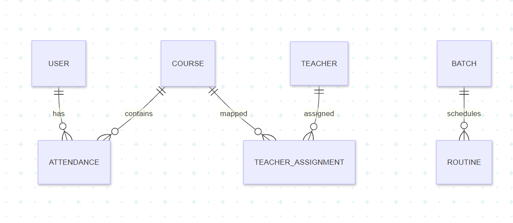

# ClassWiz

Intelligent class routine and attendance management platform for students, teachers, and administrators.

## Table of Contents

- [Executive Summary](#executive-summary)
- [Problem Statement](#problem-statement)
- [Goals and Scope](#goals-and-scope)
- [Key Features](#key-features)
- [User Roles](#user-roles)
- [System Architecture](#system-architecture)
- [Data Model](#data-model)
- [ER Diagram](#er-diagram)
- [Tech Stack](#tech-stack)
- [Project Structure](#project-structure)
- [Getting Started](#getting-started)
- [Environment and Configuration](#environment-and-configuration)
- [Documentation Index](#documentation-index)
- [Contribution Workflow](#contribution-workflow)
- [Security Guidelines](#security-guidelines)
- [Testing and Validation](#testing-and-validation)
- [Roadmap](#roadmap)

## Executive Summary

ClassWiz is an iOS-first academic operations app built with SwiftUI and Firebase. It provides a role-based interface for managing routine schedules, recording attendance, and surfacing actionable attendance insights.

The system is designed with an offline-aware user experience, deterministic analytics logic, and a modular MVVM codebase suitable for iterative team development.

## Problem Statement

Most attendance systems can store records but fail to provide:

- Clear risk visibility for students
- Practical attendance recovery planning
- Efficient role-specific operations for teachers and admins
- Reliable behavior under unstable network conditions

ClassWiz addresses these gaps through guided workflows, analytics, and structured backend access control.

## Goals and Scope

In scope:

- Student attendance and routine visibility
- Teacher attendance operations and schedule support
- Admin management of courses, routines, batches, and assignments
- Analytics-oriented attendance experience
- Firebase-backed authentication and data flow

Out of scope for current version:

- Full institutional ERP integration
- Multi-tenant enterprise deployment
- Advanced ML forecasting pipeline

## Key Features

- Role-based access: Student, Teacher, Admin
- Routine browsing and semester-aware scheduling
- Attendance marking and record management
- Attendance risk status and insights
- Student leaderboard and what-if simulation
- Admin CRUD operations for core academic entities
- Offline-aware banners and sync status indicators

## User Roles

Student:

- View class routine and attendance history
- Track attendance risk and trends
- Use simulation for attendance planning

Teacher:

- View assigned classes and schedules
- Mark and update attendance
- Access teacher-facing course views

Admin:

- Manage courses, batches, routines, and teacher assignments
- Maintain operational academic setup

## System Architecture

```text
iOS SwiftUI Client (MVVM)
        |
        | Firebase SDK
        v
Firebase Authentication
        |
        v
Cloud Firestore
        |
        v
Cloud Functions (validation, rules, aggregation)
```

Architecture principles:

- Keep UI state in ViewModels
- Keep network and persistence logic in Services
- Keep domain data in Models
- Keep shared helpers in Utilities

## Data Model

Primary logical entities include:

- users
- batches
- courses
- teacherAssignments
- routines
- attendance
- analytics
- notifications

Typical relationships:

- One batch has many students
- One course can have many attendance records
- One teacher can have many course assignments
- One student has many attendance entries across courses

## ER Diagram 

The current database ER diagram is shown below.




## Tech Stack

Frontend:

- Swift
- SwiftUI
- MVVM
- Combine (where needed)

Backend:

- Firebase Authentication
- Cloud Firestore
- Firebase Cloud Functions

## Project Structure

```text
ClassWiz/
  App/
  Core/
  Models/
  Services/
  Utilities/
  ViewModels/
  Views/
  Resources/
  PreviewData/
  Docs/
```

## Getting Started

Prerequisites:

- macOS with current Xcode
- iOS simulator or iOS device
- Firebase project with Auth + Firestore enabled

Setup steps:

1. Clone repository.
2. Open [ClassWiz.xcodeproj](ClassWiz.xcodeproj).
3. Add [ClassWiz/GoogleService-Info.plist](ClassWiz/GoogleService-Info.plist) to the app target.
4. Configure Firebase settings in console.
5. Build and run.

## Environment and Configuration

- Never commit local `.env` files.
- Keep sensitive values outside tracked source files.
- Validate Firebase project bindings before release testing.

## Documentation Index

Product and technical docs:

- [ClassWiz/Docs/app-prd.md](ClassWiz/Docs/app-prd.md)
- [ClassWiz/Docs/backend-prd.md](ClassWiz/Docs/backend-prd.md)
- [ClassWiz/Docs/frontend-prd.md](ClassWiz/Docs/frontend-prd.md)
- [ClassWiz/Docs/project-architecture.md](ClassWiz/Docs/project-architecture.md)
- [ClassWiz/Docs/workflows-and-ui.md](ClassWiz/Docs/workflows-and-ui.md)

Team and process docs:

- [ClassWiz/Docs/Maruf-Work-Detailed.md](ClassWiz/Docs/Maruf-Work-Detailed.md)
- [ClassWiz/Docs/Sarwad-Work-Detailed.md](ClassWiz/Docs/Sarwad-Work-Detailed.md)
- [ClassWiz/Docs/Zisan-Work-Detailed.md](ClassWiz/Docs/Zisan-Work-Detailed.md)
- [ClassWiz/Docs/Swift-Commits.md](ClassWiz/Docs/Swift-Commits.md)
- [ClassWiz/Docs/admin-workflow.md](ClassWiz/Docs/admin-workflow.md)
- [ClassWiz/Docs/team-sync-guide-zisan-maruf-sarwad.md](ClassWiz/Docs/team-sync-guide-zisan-maruf-sarwad.md)

## Contribution Workflow

1. Sync with main branch.
2. Create a focused branch per task.
3. Keep commits small and meaningful.
4. Open PR with clear summary and risk notes.
5. Rebase or merge latest main before final merge.

Current team coordination details live in [ClassWiz/Docs/team-sync-guide-zisan-maruf-sarwad.md](ClassWiz/Docs/team-sync-guide-zisan-maruf-sarwad.md).

## Security Guidelines

- Do not commit secrets.
- Commit [ClassWiz/GoogleService-Info.plist](ClassWiz/GoogleService-Info.plist) only if repository policy allows it.
- Enforce role checks in backend rules and server-side logic.

## Testing and Validation

Recommended checks before PR:

- App launches successfully for all primary roles
- Attendance write/read flows work correctly
- Offline indicators and reconnect behavior are sane
- No accidental secret files are staged

## Roadmap

- Improve cross-role UX consistency
- Expand attendance analytics depth
- Improve sync/conflict handling
- Add broader automated test coverage

